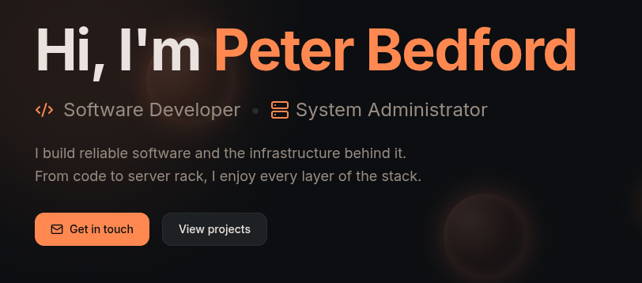

# Portfolio website stack

Monorepo for my self-hosted portfolio site, plus supporting services for relaying CCTV streams. A VPS bridges the home network and the public internet. Docker Compose files are included for the parts that run in containers.



## Website

**Path:** `home-server/portfolio-www`

Next.js and Tailwind CSS.

Local development:

```sh
cd home-server/portfolio-www
bun run dev
```

Compose: `home-server/portfolio-www/docker-compose.yml`

## CCTV relay (home)

**Path:** `home-server/cctv-relay`

MediaMTX ingests an RTSP stream from the NVR and exposes RTSP over WireGuard to the VPS.

Compose: `home-server/cctv-relay/docker-compose.yml`

## CCTV relay (VPS)

**Path:** `vps/cctv-relay`

Connects to the homelab MediaMTX instance over WireGuard, transcodes to HLS, and uses Nginx as a reverse proxy for access control.

Compose: `vps/cctv-relay/docker-compose.yml`

### Service roles

- `wireguard`: Builds the secure tunnel from VPS to homelab.
- `mediamtx-vps`: Pulls the upstream RTSP stream through WireGuard and serves it locally for downstream services.
- `api`: FastAPI service used to issue secured stream links and related stream metadata.
- `thumbgen`: Periodically captures stream thumbnails and stores them in a shared Docker volume.
- `nginx`: Internal reverse proxy for HLS, thumbnails, and API routes with header-based auth and request gating.
- `caddy`: Public edge proxy and TLS termination for internet-facing access.
- `prometheus`: Scrapes MediaMTX and stack metrics for monitoring.
- `grafana`: Dashboards and alert-friendly visualization on top of Prometheus data.
- `tailscale`: Provides private remote access to Grafana/monitoring endpoints.

### Observability example

MediaMTX dashboard snapshot:


### API

Python and FastAPI serve time-limited or secured stream links. Nginx sits in front with header-based auth. This path is mainly for testing and early development rather than production.

### Thumbnails

A periodic job generates thumbnails from the stream for use while the player is loading.

## Testing

Older stream or API tests in this repo may no longer work if auth headers or endpoints have changed since they were written.
